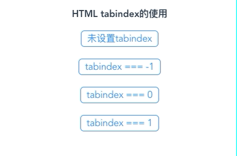
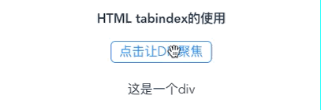

# 冷门的HTML - tabindex 的作用
> HTML 的 tabindex 属性开发过程中一般不会使用到，最近开发中有个需求兼顾富交互，便总结了一下。本篇文章同时收录在我的【前端知识点】中，[Github链接直达](https://github.com/programmer-zhang/front-end)，欢迎 Star

> 按照惯例，放上[官方定义](http://www.w3school.com.cn/tags/att_standard_tabindex.asp)

> 兼容性：Safari不支持！

## 阅读本文您将收获
* tabindex的作用
* tabindex的使用
* 如何利用 tabindex 创造更好的用户体验

## 前言
* 在我们日常使用网页的过程中，可以通过键盘控制一些元素的聚焦，从而达到便捷访问的目的

* `element` 分为 `focusable` 和 `非focusable` ,如果使用了tabindex就可以改变相关的行为

* 在HTML中有6个元素默认支持聚焦：
	* 带 `href` 属性的 `<a>` 标签
	* 带 `href` 属性的 `<link>` 标签
	* `<button></button>` 标签
	* `<input />` 标签 (排除带有 `type="hidden"` 属性的)
	* `<select></select>` 标签
	* `<textarea></textarea>` 标签
* 以上的元素默认都可以使用 `Tab` 键，以及 JS `focus()` 方法聚焦

```
document.querySelector("a").focus();
```

* 使用 `tab键` 进行聚焦元素时，聚焦的顺序等于元素在代码中的出现先后顺序，当我们进行富交互优化时，就需要用到 `tabindex` 这个属性来帮助我们进行更好用户体验的优化了

## tabindex的作用
* **①元素是否能聚焦**：通过键盘这类输入设备，或者通过 `JS focus()` 方法

* **②元素什么时候能聚焦**：在用户通过键盘与页面交互时

* **通俗来说**：就是当用户使用键盘时，tabindex用来定位html元素,即使用tab键时焦点的顺序。

## tabindex的范围
### tabindex理论上可以使用在几乎所有元素上
* tabindex 理论上可以用在几乎所有元素上，不管这个元素默认是当否支持聚焦

### tabindex 有三个值：0，-N(通常是-1)，N(正值)
* **tabindex=0**，该元素可以用tab键获取焦点
	* 且访问的顺序是按照元素在文档中的顺序来focus，即使采用了浮动改变了页面中显示的顺序，依然是按照html文档中的顺序来定位

* **tabindex<=-1**，该元素用tab键获取不到焦点，但是可以通过js获取
	* 这样就便于我们通过js设置上下左右键的响应事件来focus
	* 取值 `-1~-999` 之间没有区别，但为了可读性和一致性考虑，推荐使用 **-1**

* **tabindex>=1**，该元素可以用tab键获取焦点，而且优先级大于`tabindex=0`
	* 不过在`tabindex>=1`时，数字越小，越先定位到；
	* 如果多个元素拥有相同的 tabindex ，他们的相对顺序按照他们在当前DOM中的先后顺序决定

## tabindex的使用
#### tabindex 决定聚焦顺序
* 可聚焦元素中，正整数数值越大，顺序越往后，正整数数值的节点顺序比0值的节点靠前
* 代码：

```
// HTML
<button type="button" tabindex="1">tabindex === 1</button>
<button type="button" tabindex="999">tabindex === 999</button>
<button type="button" tabindex="0">tabindex === 0</button>
```

* 效果：


* 可聚焦元素中，相同 `tabindex` 数值的节点，根据 `DOM节点` 先后顺序决定聚焦顺序
* 代码：

```
// HTML
<button type="button" tabindex="0">tabindex === 0</button>
<button type="button" tabindex="1">tabindex === 1</button>
<button type="button" tabindex="999">tabindex === 999</button>
<button type="button" tabindex="0">tabindex === 0</button>
```

* 效果：


#### tabindex 决定是否聚焦
* 节点的 `tabindex` 设置为 `-1` 时，当前节点使用 `tab键` 不能聚焦
* 代码：

```
// HTML
<button type="button">未设置tabindex</button>
<button type="button" tabindex="-1">tabindex === -1</button>
<button type="button" tabindex="0">tabindex === 0</button>
<button type="button" tabindex="1">tabindex === 1</button>
```

* 效果：



#### tabindex 与JS编程聚焦
* 通过 `tabindex` 结合JS可以让默认不支持聚焦的节点进行聚焦,`tabindex` 为不超出范围的任何整数值都可以
* 代码：

```
// HTML
<button type="button" @click="clickBtn()">点击让DIV聚焦</button>
<div id="FocusDiv" ref="FocusDiv" tabindex="-1">这是一个div</div>

// JS
clickBtn: function() {
    document.getElementById('FocusDiv').focus();
}
```

* 效果：



## 如何利用 tabindex 创造更好的用户体验
### 针对自定义标签进行富交互优化
* 我们在创建一个自定义的标签时，如果默认行为中不包含聚焦事件，我们可以使用 `tabindex` 为它增加聚焦功能，从而可以像很多可聚焦节点一样进行顺次焦点聚焦了

### 针对特定节点禁止聚焦操作
* 某些浮层及上层节点，如 `toast`组件、模态框、侧边弹出信息等，我们不希望节点被用户聚焦捕获，可以将节点的 `tabindex` 设置为 `-1`，就能避免这一问题

### 复杂列表控制聚焦顺序
* 一些复杂的树形结构或者列式结构，如果需要用户操作顺序按照我们预想的书序进行聚焦，可以利用`tabindex` 值的大小来进行处理。