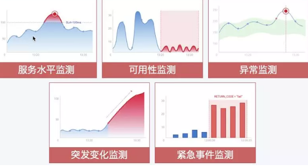
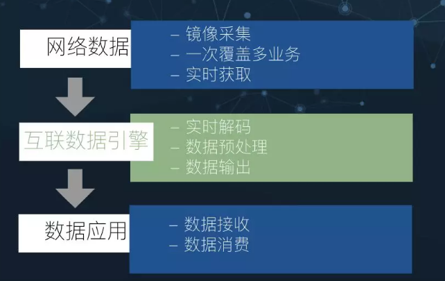

# 国家为何要大力推广IPv6？
> 文章摘要： IPv6地址是128位的，可以提供的地址总数约为43亿的4次方，号称可以为全世界的每一粒沙子编上一个地址，这将彻底解决IPv4地址资源有限的问题。

* IPv6是互联网协议第6版的缩写，是互联网工程任务组设计的用于替代IPv4的下一代IP协议。如今，我国正在加快IPV6技术的普及，而双栈改造也是实现IPv4到IPv6的无缝衔接的关键。

* 2017年11月，中共中央办公厅、国务院办公厅印发了《推进互联网协议第六版（IPv6）规模部署行动计划》，要求到2020年末IPv6活跃用户数超过5亿，新增网络地址不再使用私有IPv4地址；到2025年末，我国IPv6网络规模、用户规模、流量规模位居世界第一位。

* 为此，我国三大运营商都公布了IPv6的时间表；中国人民银行、中国银行保险监督管理委员会、中国证券监督管理委员会也于2018年12月26日联合发布了《关于金融行业贯彻&lt;推进互联网协议第六版（IPv6）规模部署行动计划&gt;的实施意见》（以下简称《意见》），加快推进基于IPv6的下一代互联网在金融行业规模部署。

* 那么，国家为什么要大力推广IPv6呢？想要实现IPv4到IPv6的无缝衔接又存在哪些挑战？带着这些问题，旦旦将与您分享我们对IPv6改造的技术探索。

## 国家为何要大力推广IPv6？
* 目前我们所用的IPv4地址是32位，大概长这样：59.123.123.123。按照这种方法可提供的地址总数有43亿个左右，但全球有上百亿个设备，显然是不够分的。另外还要减去内网专用的192、170地址段，数量就更少了。而由于中国互联网起步晚，只分到了2.9亿个IP。

* 总之，由于IPv4网络地址资源有限，严重制约了互联网的应用和发展，所以IPv6的推广便被提上了日程。

* IPv6地址是128位的，可以提供的地址总数约为43亿的4次方，号称可以为全世界的每一粒沙子编上一个地址，这将彻底解决IPv4地址资源有限的问题。

* 除了IP地址资源极其丰富之外，IPv6还更安全，响应更快。IPv6标配加密选项，用户和服务器之间的通信很难被破解。同时，IPv6能大大降低网络延迟，可以从现在普遍100ms左右，降到个位数。低网络延迟不光对打游戏有帮助，它让远程无人机、无人汽车变得可行。

* 看到这里，你是不是对IPv6充满期待呢？IPv6的前景虽然美好，但要实现从IPv4到IPv6的全面转变也并非易事，毕竟目前IPv4依旧是互联网的核心。改造的前提是不能影响正常的访问和业务运行，否则对于拥有8.54亿网民的中国来说，其影响是巨大的。因此，在很长一段时间内，我国将存在IPv4和IPv6两种协议并存的情况。

* 例如，中国人民银行、中国银行保险监督管理委员会、中国证券监督管理委员会联合发布的《意见》中就要求，「到2020年底，金融服务机构面向公众服务的互联网应用系统支持IPv6连接访问，并具备与IPv6改造前同等的业务连续性保障能力」。其目的就是要在实现IPv6改造的同时，保障日常业务稳定运行。

## 实现IPv4到IPv6的无缝衔接，你需要
* 「具备与IPv6改造前同等的业务连续性保障能力」是金融业对2020年IPv6改造的目标要求之一，这既是对双栈架构改造的挑战，也是对业务连续性保障的挑战。

* 「具备与IPv6改造前同等的业务连续性保障能力」是金融业对2020年IPv6改造的目标要求之一，这既是对双栈架构改造的挑战，也是对业务连续性保障的挑战。

### No.1 跨越双栈环境，快速定位故障、自动分析
* 在IPv4/IPv6双栈环境下，由于协议栈技术差异，指标来源口径不一致、缺少跨环境视角。当业务应用出现异常时，快速定位故障的难度将加大，对改造后的业务连续性保障提出挑战。

* 基于相同方案采集的互联数据，可实现双栈环境下的业务追踪，跨越IPv4/IPv6环境构建业务连续性评估指标体系，提供端到端的实时告警与故障定位。

* 无论是应用架构中的WEB主机、应用主机，或是防火墙、负载均衡等网络设备都能统一纳入到故障监测范围当中，提供指标口径一致、时间戳一致的故障定位分析结果。

* 基于内置的五大场景化告警模块（服务水平监测、可用性监测、异常监测、突发变化监测、紧急事件监测），设置精准告警条件，覆盖常见的所有故障情况。

* 一旦故障发生，即刻获知告警事件，并将故障定位至应用/网络层面，及具体应用节点。同时系统还会自动化完成故障成因分析，帮助提高故障诊断效率；自动保存原始交易明细、网络报文，供技术专家深入挖掘分析使用。

### No.2 多维度对比，让改造效果可视化、易评估
* 为了实现IPv4/IPv6双栈协议架构，金融服务机构往往会采购新基础设备或升级原有应用。想要在IPv4/IPv6双栈环境下，对这些节点的性能、可用性情况进行有效评估，就需要跨越IPv4及IPv6双栈的复杂环境抽象出应用访问路径，统一IPv6新节点与原有IPv4环境下旧节点的性能评估视角。而互联数据的技术特性正好能够满足这些需求。

* 基于网络旁路技术采集的互联数据具有“对被管理对象不敏感”的技术特性，能够在IPv4及IPv6混合访问的设备节点对关键指标进行监测分析，统一性能与可用性评估口径。从而提供多维度、时间偏移的指标对比分析能力，帮助使用者实施掌握架构改造前后、以及IPv6与IPv4，不同维度间访问请求的应用、网络性能差异，为各项评估提供指标依据：

* 架构改造前后对比：对比互联网应用架构改造前后的负载、可用性、性能差异，以便评估调整架构改造策略。

* IPv6与IPv4流量对比：对比互联网应用通过IPv6及IPv4入口访问的性能差异，以及流量分担比例，以便理解双栈入口流量状态，评估调整流量策略。

### No.3 多模式展示，让改造成果展示更直观
* 为了让各项关键指标的呈现更加直观，我们还支持多种展示模式，以匹配不同工作场景和使用对象。

* 如参观模式作为业务运行总览，为重大节假日、视察参观、金融交易实况等领导关注的场景设计数据内容和视觉呈现方式；保障监控模式作为业务视角的运维监控，可以跨越IPv4与IPv6双栈环境，实时展现业务系统架构及业务运行状态；专家模式作为自定义专家诊断视图，可根据使用习惯、特定场景自定义故障诊断分析视图，帮助技术专家提高故障诊断效率。

### No.4 外部系统快速整合，保护原有投资、避免浪费
* 金融服务机构采购新基础设备或升级原有应用后，原本应用于IPv4协议栈环境的营销、风险监测等业务分析系统，或不能很好地支持IPv6协议栈数据，使得双栈环境下，原有的系统投资不能充分得到利用。

* 基于BPC Open API Gateway，通过可靠的权限控制，与运维、开发、业务等各个团队分享业务大数据的资源应用，与原有外部业务分析系统进行整合，从而避免了对这些系统的重复投资，减少浪费。

* 目前，该方案已经在部分五大行及股份制商业银行中落地应用，帮助用户实现了改造和统一化的运维管理。

### 互联数据，统一数据语言，让业务大数据治理即刻落地
* 互联数据作为一种全量、实时、统一的数据源，通过将交易过程中各个环节、应用产生的数据进行实时、全量的解析、治理后，输出时间戳统一、数据格式统一的高质量数据源，可以直接应用于业务性能、业务风险、业务成长等管理的方方面面，帮助客户从业务视角下挖掘大数据应用的更多价值。同时，互联数据采用旁路式技术，非入侵方式不改造应用，不影响数据库性能。

* 目前，互联数据已积累覆盖风险管理类、营销类、管理类、科技类的20多种应用场景。支持400多种行业互联数据，2000多种特色业务应用协议；再此之上还全新拓展500+协议解码场景。实时解码，统一数据语言，让业务大数据治理即刻落地！

> 原文链接：[国家为何要大力推广IPv6?](http://ipv6.infosws.cn/20200228/32244.html)