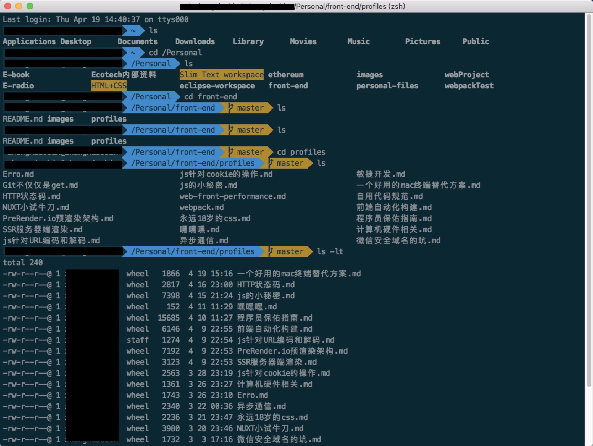
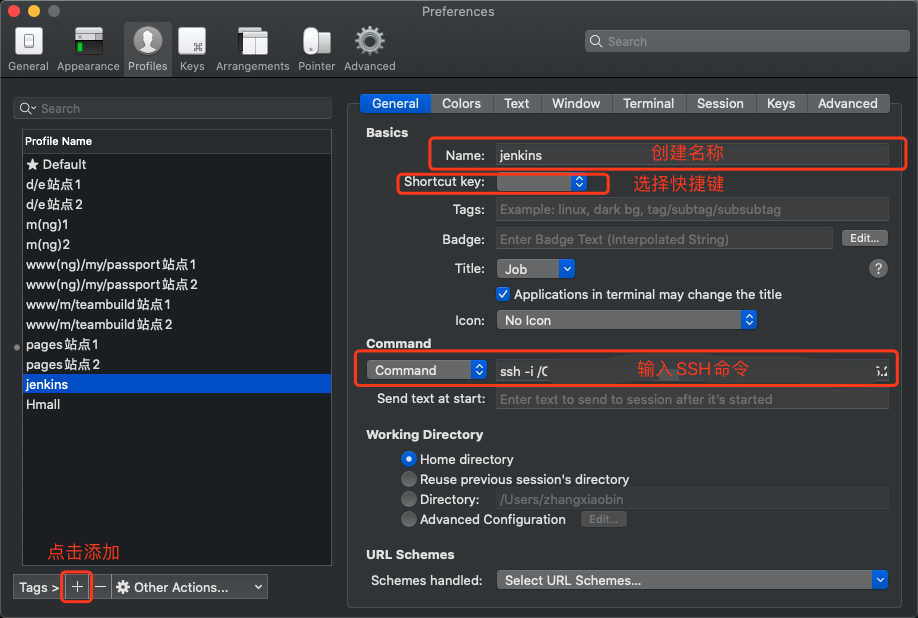
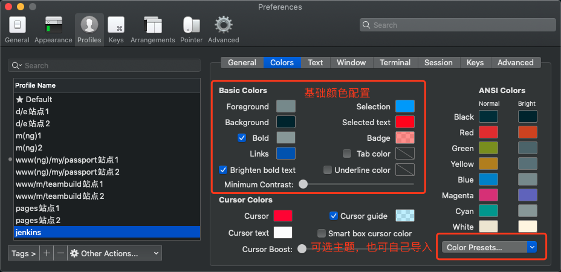
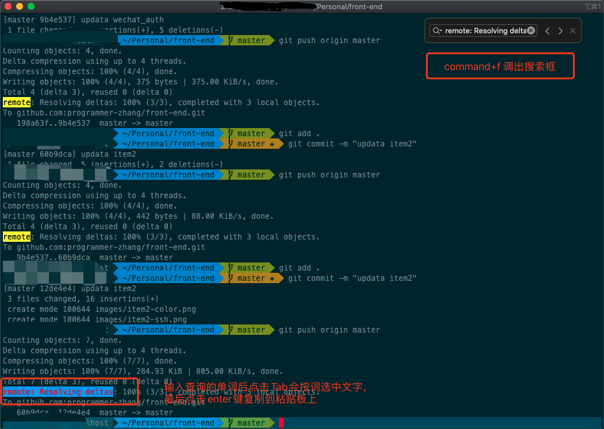

> 之前一直用 MAC OS 自带的终端进行操作，但总感觉差点事，于是在同事的介绍下，用上了iTerm2，结合 on my zsh 之后发现很强大，正式入坑。

> 文章建议阅读时间：5分钟(建议阅读配合实践)

## 阅读本文您将收获：
* iTerm2 安装
* iTerm2 使用技巧

## 安装iTerm2
* 方式一
	* [下载地址](https://www.iterm2.com/index.html)
	* 解压之后便是执行程序文件
* 方式二
	* 使用 MAC OS 自带的 Homebrew 进行安装 `$ brew cask install iterm2`
	* 电脑缺少 Homebrew 的同学可[点击这里尝试安装](https://github.com/programmer-zhang/front-end/blob/master/profiles/homebrew.md)

## 配置iTerm2主题(可选)
* 推荐一个主题 Solarized Dark theme [下载地址](http://ethanschoonover.com/solarized)
* 解压文件，打开 ` Preferences -> Profiles -> Colors -> Color Presets -> Import `，选择刚才解压的 ` solarized->iterm2-colors-solarized->Solarized Dark.itermcolors `文件，导入成功，最后选择 Solarized Dark 主题，关掉终端重启就大功告成了

## 配置 On My Zsh
* Oh My Zsh 是对主题的进一步扩展
* MAC OS 是自动集成Zsh的，查看本地Zsh ` Zsh --version `
* 一键安装 Oh My Zsh

``` 
$ sh -c "$(curl -fsSL https://raw.github.com/robbyrussell/oh-my-zsh/master/tools/install.sh)" 
```

* 把 Zsh 设置为当前用户的默认 Shell（这样新建标签的时候才会使用 Zsh）  ` $ chsh -s /bin/zsh `
* 编辑 ` vim ~/.zshrc ` 文件，将主题配置修改为 ` ZSH_THEME="agnoster" ` 
* agnoster 主题是比较常用的主题，这里还有一份[Zsh的主题列表](https://github.com/robbyrussell/oh-my-zsh/wiki/themes)

## 配置Meslo字体
* 使用上面的主题就需要支持 Meslo 字体，不然会出现乱码的情况
* [字体下载地址](https://github.com/powerline/fonts/blob/master/Meslo%20Slashed/Meslo%20LG%20M%20Regular%20for%20Powerline.ttf)
* 下载成功直接安装
* 然后在 iTerm2 中 ` Preferences -> Profiles -> Text -> Font -> Chanage Font ` 选择 ` Meslo LG M for Powerline ` 字体
* 如果字体大小不满意，可以一并修改

### VS Code 字体配置
* 经常使用 VS Code 的朋友还需要修改 VS Code 的字体配置
* 用户配置，搜索 `fontFamily`，然后将右边的配置增加 

``` 
"terminal.integrated.fontFamily": "Meslo LG M for Powerline" 
```

* 配置信息


* 效果就是酱紫 


	
## 来一本82年的使用手册
### 启动一个远程 server 终端
* 选择 `Preferences->Profiles` ，新增一个 `profile` ，并设置启动的快捷键和 `ssh` 命令, 如图


	
* 完成后就可以用快捷键或者在顶部工具栏 `Profiles` 中直接点击进行连接，真香！

### 色彩方案配置(有强迫症的开发者可以配置一下)
* 很多工程师对自己的开发工具有很高的颜值要求，`iTerm2` 同样给使用者提供了可配置颜色和部分主体，除了上面安装说明中提到的主题网站外，`iTem2` 也给我们提供了很多自选主题。
* 选择 `Preferences->Profiles->Colors`, 就可以自行配置了，如图 


	
* 配置完重启客户端，呵，有内味了！
	
### 提高文本使用效率
* 作为终端工具 `iTerm2` 自然提供了搜索功能，用户使用搜索可以使用 `tab 键` 自动按照单词选中后面的语句，类似于终端文件联想功能，然后点击 `Enter 键` 就可以将选中的文字复制到粘贴板上。


	
### 终端指令提示
* 终端指令太多记不清楚怎么办，输入字符，点击 `command + ;`，`iTerm2` 会自动给你展开提示

### 调出复制粘贴历史
* `iTerm2` 提供了复制粘贴历史记录的功能，使用快捷键 `shift + command + H` 就可以在光标处调出复制粘贴历史， so easy!

### 输入历史
* 正常的终端都能通过键盘上下键，而 `iTerm2` 能够做到记录你的输入字符
* 使用快捷键 `option + command + b`, `iTerm2` 打开一个进度条供你查看输入的字符


	
### 显示命令执行时间轴、
* 高手玩家往往时间运行比较高效，需要知道自己每时每刻都做了什么，普通玩家可能在开发过程中需要知道编译用了多久，`iTerm2` 自带时间轴，让你的使用变得准确
* 点击工具栏中的 `view->showTimestamps` 打开时间轴


### 高亮显示光标所在行
* `iTerm2` 还提供了所在行高亮功能
* 点击工具栏中的 `view->showAnnotations` 打开高亮行显示
	
### 更多使用技巧
* 查看更多使用技巧请点击[官方链接](https://www.iterm2.com/documentation.html)
