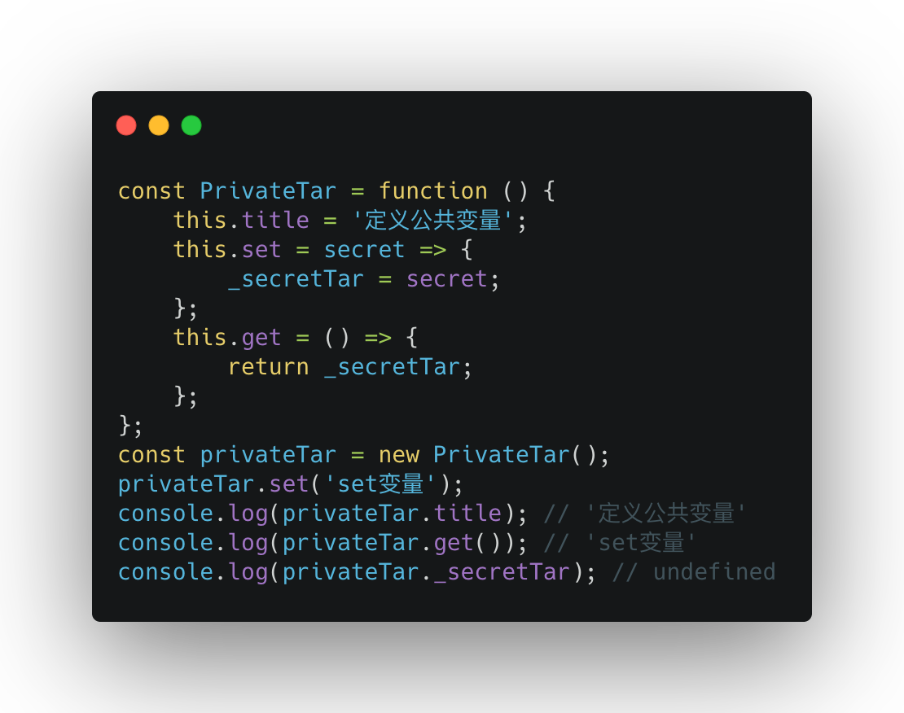
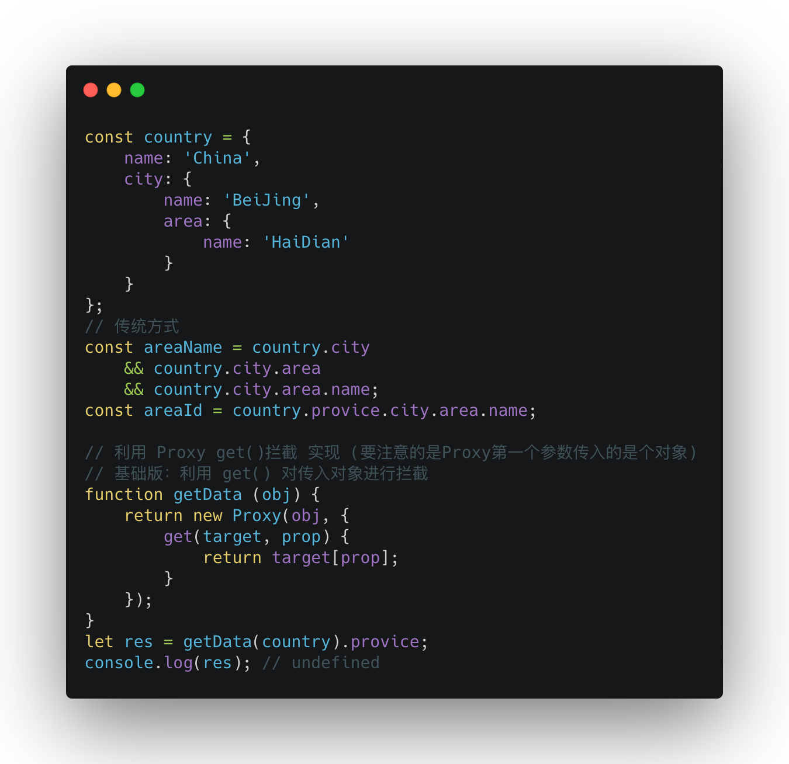
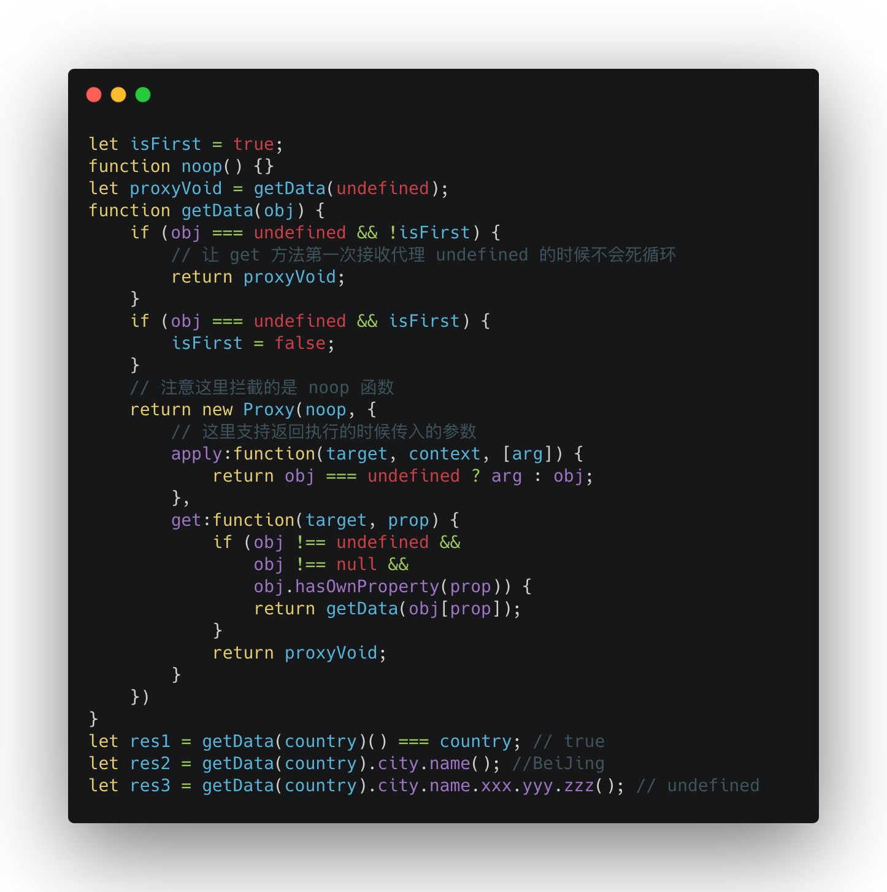
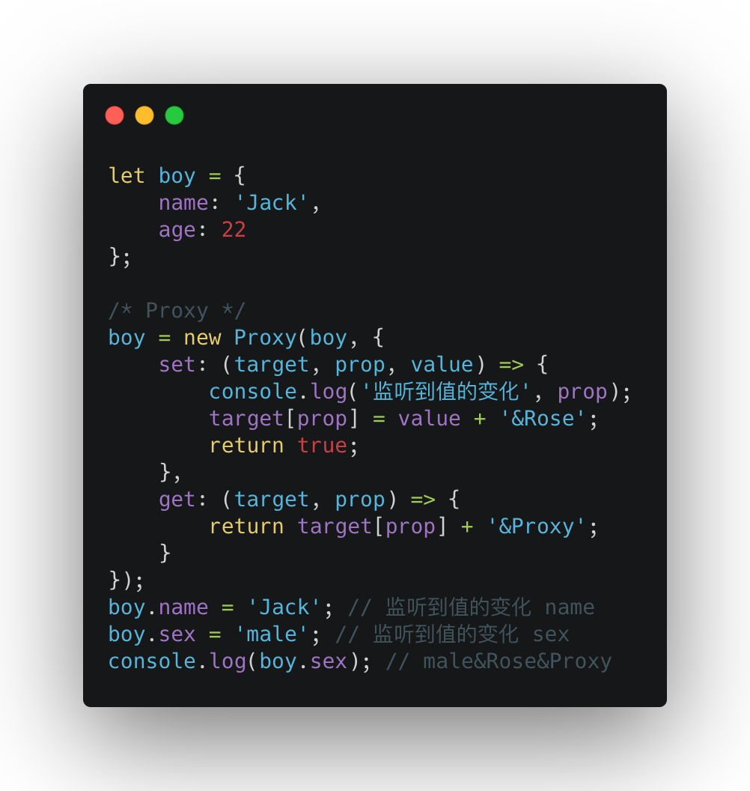

## 阅读本文您将收获
* `JavaScript` 中的 `Proxy` 是什么？能干什么？
* `Vue3.0` 开始为什么 `Proxy` 代替 `Object.defineProperty`

## `Proxy` 是什么
> 解释参考MDN，[链接直达](https://developer.mozilla.org/zh-CN/docs/Web/JavaScript/Reference/Global_Objects/Proxy)

### 名词解释
* Proxy 对象用于定义基本操作的自定义行为（如属性查找、赋值、枚举、函数调用等）
* Proxy 用于修改某些操作的默认行为,也可以理解为在目标对象之前架设一层拦截,外部所有的访问都必须先通过这层拦截,因此提供了一种机制,可以对外部的访问进行过滤和修改

### 语法
* `const p = new Proxy(target, handler)`
	* `target`: 要使用 Proxy 包装的目标对象（可以是任何类型的对象，包括原生数组，函数，甚至另一个代理）
	* `handler`: 对该代理对象的各种操作行为处理(为空对象的情况下，基本可以理解为是对第一个参数做的一次浅拷贝)
* 简而言之：`target` 就是你想要代理的对象；而 `handler` 是一个函数对象，其中定义了所有你想替 `target` 代为管理的操作对象，包含了：
	* *`handler.has()`: `in` 操作符的捕捉器
	* *`handler.get()`: 属性读取操作的捕捉器
	* *`handler.set()`: 属性设置操作的捕捉器
	* *`handler.apply()`: 函数调用操作的捕捉器，拦截函数的调用、call和apply操作
	* `handler.getPrototypeOf()`: `Object.getPrototypeOf` 方法的捕捉器
	* `handler.setPrototypeOf()`: `Object.setPrototypeOf` 方法的捕捉器
	* `handler.isExtensible()`: `Object.isExtensible` 方法的捕捉器
	* `handler.preventExtensions()`: `Object.preventExtensions` 方法的捕捉器
	* `handler.getOwnPropertyDescriptor()`: `Object.getOwnPropertyDescriptor` 方法的捕捉器
	* `handler.defineProperty()`: `Object.defineProperty` 方法的捕捉器
	* `handler.deleteProperty()`: `delete` 操作符的捕捉器
	* `handler.ownKeys()`: `Object.getOwnPropertyNames` 方法和 `Object.getOwnPropertySymbols` 方法的捕捉器
	* `handler.construct()`: new 操作符的捕捉器

## `Proxy` 能干什么
### 一：直观的私有变量/拦截has...in...操作

### 二：数据校验

### 三：mock数据

### 四：深层取值判断
* **php语法深层取值不存在为什么不报错？**

## Vue 3.0 的 Proxy & Object.defineProperty 
### Object.defineProperty 
* **劫持方式**：只能劫持对象的属性，不能直接代理对象
* **存在的问题**：虽然 `Object.defineProperty` 通过为属性设置 `getter/setter` 能够完成数据的响应式，但是它并不算是实现数据的响应式的完美方案，某些情况下需要对其进行修补或者hack，这也是它的缺陷，主要表现在两个方面：
	* 无法检测到对象属性的新增或删除
	* 不能监听数组的变化

### 1. Object.defineProperty 无法监听新增加的属性
* 解决方式：提供方法重新手动Observe，需要监听的话使用 `Vue.set()` 重新设置添加属性的响应式

### 2. Object.defineProperty 无法一次性监听对象所有属性，如对象属性的子属性
* 解决方式: 通过递归调用来实现子属性响应式

### 3. Object.defineProperty 无法响应数组操作
* 解决方式：通过遍历和重写Array数组原型方法操作方法实现，但是也只限制在 `push/pop/shift/unshift/splice/sort/reverse` 这七个方法，其他数组方法及数组的使用则无法检测到

### 4. Proxy 拦截方式更多, Object.defineProperty 只有 get 和 set

### 5. Proxy 新标准性能红利
* `Proxy` 作为新标准，从长远来看，JS 引擎会继续优化 `Proxy`

### 6. Proxy兼容性差
* `Vue 3.0` 中放弃了对于IE的支持
* 目前并没有一个完整支持 `Proxy` 所有拦截方法的 `Polyfill` 方案，有一个 `google` 编写的 `proxy-polyfill` 也只支持了 `get/set/apply/construct` 四种拦截

## Decorator
* ES7 中实现的 `Decorator`，相当于设计模式中的装饰器模式。
* 如果简单地区分 `Proxy` 和 `Decorator` 的使用场景，可以概括为：`Proxy` 的核心作用是控制外界对被代理者内部的访问，`Decorator` 的核心作用是增强被装饰者的功能。
